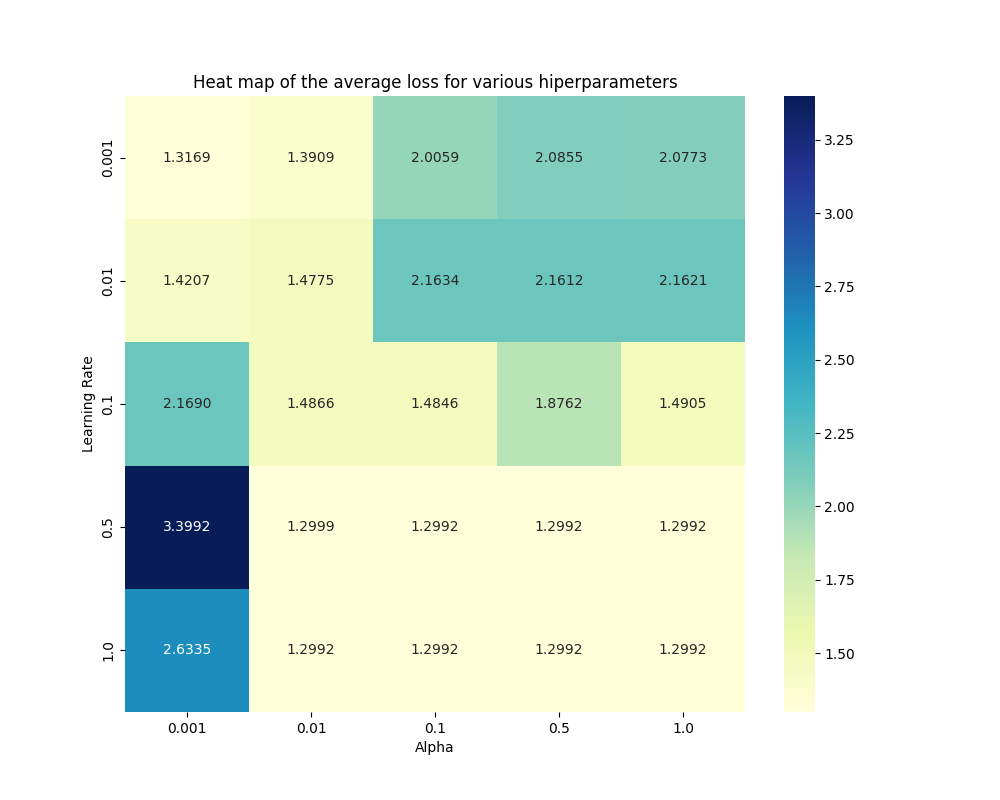
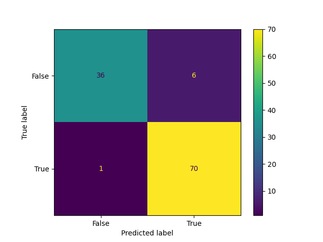

# Neural network 

This project presents the implementation of a multilayer perceptron (MLP) neural network trained using the stochastic gradient descent (SGD) algorithm, exclusively utilizing Numpy as an auxiliary library in the development. 

Prioritizing hands-on practice and in-depth study of neural network fundamentals, the code features custom functions for data preprocessing, k-fold cross-validation for hyperparameter tuning, and visualization of average losses. Moreover, the neural network architecture is designed to accommodate customizable hidden layers with a sigmoid activation function, further incorporating L2 regularization. 

The primary objective of the implemented neural network is to classify breast tumors as either benign or malignant. The main function loads the Breast Cancer dataset and executes model training through batch processing.

By analyzing features extracted from tumor samples, such as cell characteristics and structure, the model is able to provide accurate and reliable assessments, having an accuracy of around $93\%$.

## Result Analysis 

The results presented here correspond to a simulation using the seed number 42 for shuffling the dataset.

### Choosing hyperparameters
The first step the neural network takes is to determine which hyperparameters yield the smallest loss. The hyperparameters tested are:

    alphas = [0.001,  0.01,  0.1,  0.5,  1]
    learning_rates = [0.001,  0.01,  0.1,  0.5,  1]

Once we have the results for each combination, the program displays a heatmap of the losses found.

  

Despite not being visible in the heatmap due to the constraint of four decimal places, the best combination of parameters found is:

    Best hiperparameters: Learning rate = 1, Regularization term = 0.01

which yields an average loss of approximately $1.2991862566553007$. 

### Training and testing the model 

After finding the best parameters, we train and test the model. 

FInally, the simulation yields an accuracy of $93.81\%$. Along with the acuracy, the confusion matrix is illustrated below. 

  

---
### Updates

-   September 20th, 2023: Initiation of the project development.
-   November 22nd, 2023: Successful completion of the project.
-   Feburary 2nd, 2024: Project translated and documented in English.

### Further Information

The code presented in this repository was delivered as a project in the 'Artificial Intelligence' course within the Applied and Computer Mathematics bachelor's degree @ POLI-USP. 